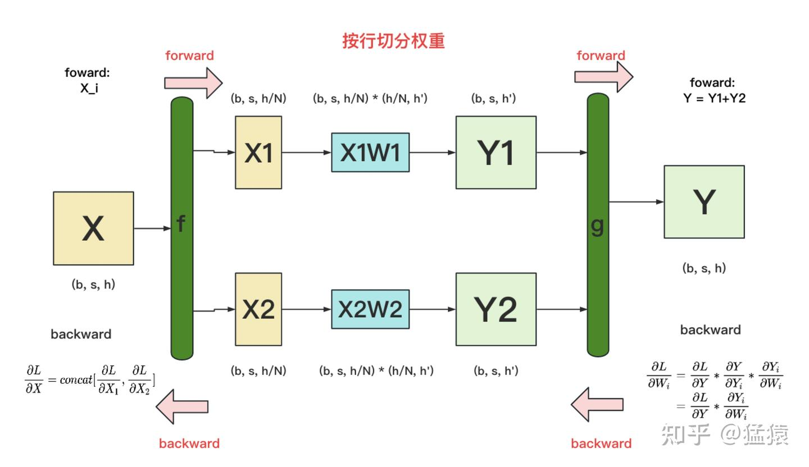
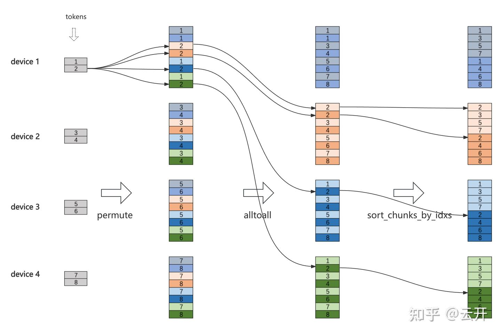
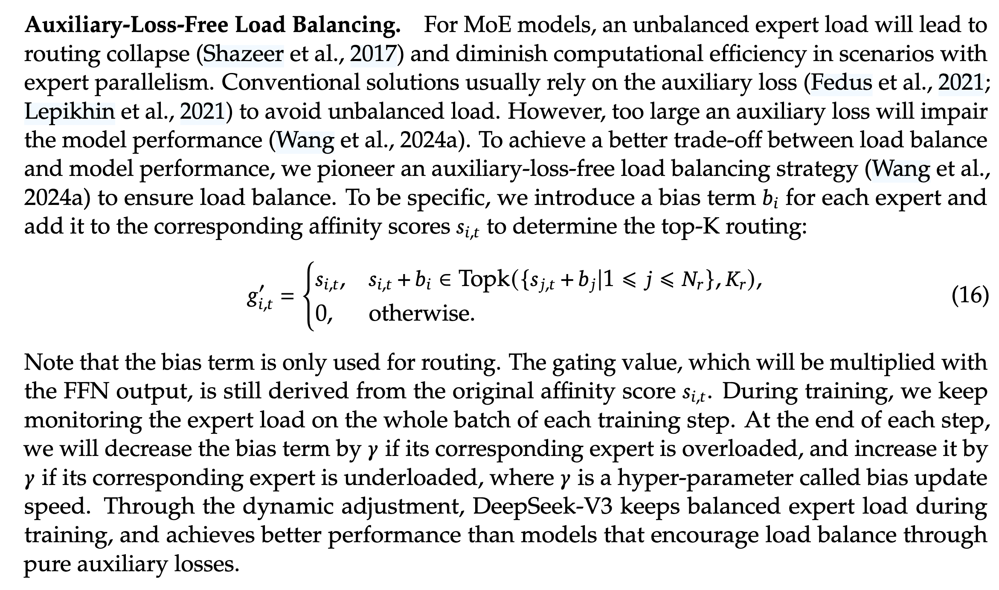

<!--Copyright © ZOMI 适用于[License](https://github.com/Infrasys-AI/AIInfra)版权许可-->

# MoE 从原理到分布式实现（Done）

> Author by: 张天翔、ZOMI

在前面的学习过程中，我们已经实现了一个单机单卡MoE的小demo，但是实际场景下MoE模型太大（专家大小，专家数量），单GPU内存不能容纳所有专家，因此要采取分布式部署的策略才能让专家权重存储在GPU昂贵的内存中。那么问题来了，已知有DP、TP、EP等多种并行方案，哪一种方案更加贴合MoE模型（算法侧）呢？为什么呢？这些并行方案之间孰优孰劣，各自适合什么场景呢？本文就让我们一起来探究原理，最后动手实现一个分布式MoE（EP）的分布式demo。

# 原理分析

## DP、TP、EP定义
首先回答“是什么”，参考了[这篇文章](https://zhuanlan.zhihu.com/p/1967192540953425479)：
* DP：每块GPU复制全量模型，拆分输入batch给每个设备独立计算，每个设备都能独立得到结果，不需要通信。
* TP：将模型权重切分成若干chunks，将小chunk放在单个GPU上。由于模型被切分，不能独立得到结果，所以需要AllReduce通信。参考这篇[文章](https://zhuanlan.zhihu.com/p/622212228)，很推荐阅读。
    * 模型切分有两种方式：横着切和竖着切；这里最好搞明白——MLP先列切再行切，由于GELU的性质可以减少一次不必要的allreduce通信
    * Transformer架构中大概有两块可以用TP做切分：MLP和MHA，MLP切分就在上图，MLA切分就沿着num_heads维度切分QKVweights到多个GPUs上。
* EP：针对MoE这一层，将专家权重（MLP）独立的放在不同的GPU上。比如有32个专家和4块GPU，则每个GPU容纳8个独立的专家权重。

## EP AlltoAll 

EP部署带来的一个核心问题是，专家不再在同一个GPU上了，而输入batch-size个tokens，它们根据gate网络打分，选择该token要前往的专家；在选中专家上计算完之后需要重新回到它来的那张卡上，这个过程就称为AlltoAll（简称ata）通信。

配合图片直观的理解一下，图片来源：https://zhuanlan.zhihu.com/p/28867733102



有四个device，每个GPU输入两个token，每个token选择四个专家（四个箭头）。颜色代表专家，有八种颜色意味着有八个专家，每块GPU上有两个专家（权重）。token最开始是没有颜色的（灰色，代表还没选择专家）。

拿device1上的token2举例，有四个箭头代表选中了四个专家。permute这步之后代表做完了专家选择（token开始有颜色，颜色代表了要去的GPU“组”，这里一个GPU上有两种颜色，也就是两“组”）。alltoall这步之后，每个token去到颜色对应的专家。最后sort_chunksby_idxs，同一块GPU内有两种颜色，每个颜色内根据输入tokenid大小做升序。

ata在NCCL文档中是这么定义的：每个进程向所有其他进程发送count个值，并从所有其他进程接收count个值。发送到目标进程j的数据取自sendbuff+j\*count，从源进程i接收的数据被放置在recvbuff+i\*count处。对应着下面这张图：


而它在Pytorch中有这样一个接口，函数签名：`torch.distributed.all_to_all_single(output, input, output_split_sizes=None, input_split_sizes=None, group=None, async_op=False)`
将输入张量拆分，然后将拆分后的列表分散到组中的所有进程。之后，从组中所有进程接收的张量会被连接起来，并作为单个输出张量返回。

## 为什么大规模部署优先选择EP？

完全（MoE+non-MoE）用DP部署由于内存原因首先被排除，我们试着从计算、通信两个角度去分析TP、EP孰优孰劣？

### 通信量分析

给出抽象的定量分析：moe_config:{num_experts, ep_world_size(rank_size), topk}, local_token.shape = [b, s, h]

初始，每个rank有$b*s$个token；dispatch完成之后，每个rank有$b*s*topk$个token（假设专家负载均衡）。我们现在想求出需要真正发送出去的token数量（终点dst不在本rank上），每个rank发送$b*s*topk$个token，这个token落在其他rank的概率是$\frac{ep\_world\_size-1}{ep\_world\_size}$，所以对本rank真正需要跨卡发送出去的token数量的期望是$b*s*topk* \frac{ep\_world\_size-1}{ep\_world\_size}$。半精度情况下，数据量是$2*b*s*topk* \frac{ep\_world\_size-1}{ep\_world\_size}*h$ bytes。同时，combine是dispatch的逆过程，因此对于每个rank来说，半精度，完整ep ata通信量近似为$4*b*s*h*topk$ Bytes。

而TP，在上面的图里，Z1Z2都是$V = [b,s,h]$，需要做一次allreduce得到最后的Z，同样对于半精度，每个tp-rank通信的数据量是$2*b*s*h*2 = 4*b*s*h$ bytes。第一个2因为半精度，第二个2因为ring-allreduce包含了reduce scatter和allgather两个步骤。假设TPsize=T，每个rank需要进行通信的tensor大小是V，ring-allreduce会将V切成$\frac{V}{T}$大小的chunk。在reduce scatter阶段，每个step下每个rank发送$\frac{V}{T}$的chunk，总共有$T-1$步，因此在reduce scatter阶段，每个rank发送了$\frac{T-1}{T}V$数据。allgather阶段同理，因此对于每个tp rank，ring-allreduce通信量是$2 \times \frac{T-1}{T}V$，在半精度情况下，约等于$4*b*s*h*$ bytes。

（上面的分析中，TP和EP都近似掉了$\frac{T-1}{T}$这个系数，所以得到的结论是精确的）看起来TP比EP优化了topk倍的通信量，真的是这样吗？

实际部署下，还需要考虑DP的因素。假设总token数量是$1*128$，world_size=32（gpu数量，4张8卡的机器）。
* 对于TP=8来说，DP=4，首先四台机器，每个机器输入$128 \div 4 =32$个token，对于每个tprank来说，通信量是$4*1*32*h=128h$bytes。
* 但是对于EP=8来说，开EP并不影响DP数量。只有moe层通过跨机EP ata进行通信，而非moe层可以开DP=32，权重完全复制，内存压力稍大。也就是说，每张卡输入$128 \div 32 =4$个token，在gating计算完之后，token通过ata进行一次机内通信（因为EP=8，而一个节点八张卡，正好不需要跨机通信），在dst卡计算完后返回到src卡。通信量是$4*1*4*h*topk=16h*topk$ bytes。
* 此时再对比TP、EP通信量，当$topk>8$时，EP通信量大于TP，否则EP更优。事实上，抽象一下就可以知道，这里的8正是parallelsize=tpsize=epsize。
* 得出结论，当$top\_k<parallel\_size$时，EP更优。

### 计算优势分析
计算上的优势主要来源于EP可以在机内将多个本地专家计算聚合为单个批处理GEMM(batched-gemm, bmm)操作。这样我们就不用通过`for expert in range(num_experts):`这样的循环，降低了频繁kernel launch的开销；除此以外，由于GPU针对大规模并行计算进行了优化，将多个小尺寸矩阵乘法聚合成单个大尺寸矩阵乘法的操作能更好地发挥其性能，从而提高利用率和效率。

具体可以去看我翻译的这篇博客：[What Shapes Do Matrix Multiplications Like?](https://zhuanlan.zhihu.com/p/1984323735117919137)，以及 Pytorch Blog —— [Training MoEs at Scale with PyTorch](https://pytorch.org/blog/training-moes/)

# 代码实现

这一节把前面的分析落到代码：我们实现一个 **Expert-Parallel（EP）MoE layer** 的最小可运行版本，并用一个 toy 任务跑通训练闭环，重点放在：

1. **routing / top-k**：gate 对每个 token 选择 top-k 专家；
2. **dispatch（All-to-All）**：把 token 派发到“专家所在的 rank”；
3. **local expert forward**：每个 rank 只计算自己持有的本地专家；
4. **combine（All-to-All）**：把专家输出回传到源 rank，并按 top-k 权重聚合回 token 序列；
5. **训练闭环**：反向传播穿过 gate + experts + 通信算子（这里用 autograd-aware 的 dist.all_gather 实现）。

实现里 ata（all-to-all）算子参考了这个 [reference](https://github.com/gpu-mode/reference-kernels/blob/eff169759596326890b23d4625cb6d5923266e55/problems/amd_distributed/all2all/reference.py#L54)

说明：完整的高性能 MoE/EP 训练显然有更多优化空间，例如：
* 更系统的分布式张量/梯度管理或者并行（比如 DTensor）
* 计算通信并行掩盖通信开销：TBO使用双batch重叠来掩盖多机多卡Ata通信开销；Deepseek提出的Shared Experts的计算也可以和dispatch通信并行重叠。
* 高效通信：ata通信中存在较大的通信冗余，拿我们最上面的那张图来说明：
    * 同一个 token dispatch 到同一台 device 的不同 expert （如 token2 dispatch 到 device 2 的 两个 expert)。
    * 同一个 token dispatch 到同一台 host 的 不同 device (如 token2 dispatch 到 device 3 和 device 4)。这点可以由一次机间通信加机内通信替代来减少机间通信。

在这个Notebook里，我们以“可读 + 可跑通”为目标，先把核心数据流和通信逻辑写清楚。

> 小提示：本 notebook 最后一个 cell 会用 `torchrun` 启动多进程训练。因为 `torchrun` 是新进程，它不会共享 notebook 内存，所以我们会从 notebook 中抽取若干 code cell 拼成临时脚本再运行。

## 环境检查

环境有多重要想必不必多说

```
import os
import torch

# 检测 GPU 数量
gpu_count = torch.cuda.device_count()
print(f"检测到 {gpu_count} 个 GPU")

if gpu_count >= 2:
    print(f"✅ 多 GPU 环境，将使用 torchrun 启动分布式训练 (建议使用 {gpu_count} 个 GPU)")
    print("📝 后续实验将通过 %%writefile 创建临时脚本，自动运行 torchrun，并清理临时文件")
else:
    print("⚠️  警告: 检测到少于 2 个 GPU，分布式训练可能无法正常运行")

print(f"\n 实验配置:")
print(f"  - GPU 数量: {gpu_count}")
print(f"  - CUDA 可用: {torch.cuda.is_available()}")
print(f"  - PyTorch 版本: {torch.__version__}")
```

```
检测到 2 个 GPU
✅ 多 GPU 环境，将使用 torchrun 启动分布式训练 (建议使用 2 个 GPU)
📝 后续实验将通过 %%writefile 创建临时脚本，自动运行 torchrun，并清理临时文件

 实验配置:
  - GPU 数量: 2
  - CUDA 可用: True
  - PyTorch 版本: 2.3.0+cu121
```

## 基本组件实现

### class MoEConfig

先定义一个 `MoEConfig`，统一管理 EP-MoE 里最关键的超参数：

- `num_experts`：全局专家总数（所有 rank 上专家的总和）。
- `experts_per_token`：每个 token 选择的专家个数（top-k）。
- `hidden_dim`：token hidden size，也是专家 MLP 的输入/输出维度。
- `max_num_tokens`：用于通信 buffer 的上界（需要能覆盖本 rank 一次前向里可能出现的 token 数）。
- `in_dtype/out_dtype`：输入/输出 dtype（实现里会在专家计算时临时转成 `float32` 以简化数值问题）。

约束/注意：
- 训练时如果 `bsz`（或 token 数）超过 `max_num_tokens`，需要增大 `max_num_tokens`，否则后面会出现 buffer 不够的情况。
- `num_experts` 必须能被 `world_size` 整除（每个 rank 拥有同样数量的本地专家）。


```
import dataclasses
import torch

@dataclasses.dataclass
class MoEConfig:
    num_experts: int
    experts_per_token: int
    hidden_dim: int
    max_num_tokens: int
    in_dtype: torch.dtype = torch.float16
    out_dtype: torch.dtype = torch.float16
```

### class PyTorchAllToAll

这部分实现 EP 最核心的通信算子（ata / all-to-all）的一个“教学版”。

**为什么不用 `all_to_all_single`？**
- `torch.distributed.all_to_all_single` 的语义非常贴合 MoE：它天然支持每个 rank 发/收不等长分片（split sizes），对应“不同专家收到不同 token 数量”的现实情况。
- 但`all_to_all_single`仅支持传递data，而不传递grad，也就是说在训练场景并不适用。（可以自己写个脚本check一下）
- 这里选择了 **pad + `dist.nn.functional.all_gather`** 的实现：把每个 rank 的发送条目 pad 到同样长度，再 gather 后按 meta 过滤。

**核心数据结构：buffer + metadata**
- buffer：存 token hidden（形状近似 `[num_items, hidden_dim]`）。
- metadata：为每条 token 记录“轨迹”，以便 combine 时把结果放回正确位置。这里用 `META_DIM=5`：

| 字段 | 含义 | 作用 |
|---|---|---|
| `global_exp` | 全局专家 ID | 决定 token 应该派发到哪个 rank/哪个本地 expert |
| `src_rank` | 源 rank | combine 时决定回传到哪个 rank |
| `src_token` | 源 token 下标 | combine 时回填到哪个 token 位置 |
| `src_k` | top-k 序号 | combine 时取 `weights[token, k]` 做加权 |
| `pad` | padding 标记/占位 | 这里简化为 0，占位即可 |

**dispatch 的输入/输出（概念上）**
- 输入：
  - `dp_x`: 当前 rank 的 token，shape `[num_tokens, hidden_dim]`
  - `indices`: 每个 token 选中的专家 ID，shape `[num_tokens, topk]`
- 输出（落桶到本地专家）：
  - `expert_num_tokens`: shape `[num_local_experts]`
  - `expert_x`: shape `[num_local_experts, max_recv, hidden_dim]`（按本地 expert 分桶后的输入）
  - `expert_meta`: shape `[num_local_experts, max_recv, META_DIM]`

**实现上的重要取舍（也正是性能瓶颈来源）**
- 需要把发送条目 pad 到统一长度，导致额外通信/拷贝（对负载不均时尤其明显）。
- 通过 Python 循环组装/落桶（而不是向量化/融合 kernel），开销偏大。
- 这是为了把“数据如何流动”说清楚；在总结里会列出更贴近真实训练的优化方向。

```
# pytorch_all2all.py
import torch.distributed as dist
import torch.distributed.nn.functional as dist_nn

# ---------------- All2All pytorch impl ----------------
class PyTorchAllToAll:
    META_DIM = 5  # global_exp, src_rank, src_token, src_k, pad

    # 初始化一些分布式需要的变量
    def __init__(self, cfg: MoEConfig, rank: int, world_size: int):
        self.cfg = cfg
        self.rank = rank
        self.world_size = world_size
        # num experts per rank
        self.num_local_experts = cfg.num_experts // world_size
        # max recv tokens per rank，不满足的用 padding
        self.max_recv = cfg.max_num_tokens * world_size

    # ---------- dispatch ----------
    # dp_x 当前 rank（gpu）拥有的 token，shape = [num_tokens,hidden_dim]
    # indices: 每个 token 选中的全局专家ID列表，形状 [num_tokens, experts_per_token]，值域 [0, num_experts)。
    # TODO experts_per_token 就是 topk，能不能改成 topk？并且作为一个可以从外部传入的参数。
    def dispatch(self, dp_x: torch.Tensor, indices: torch.Tensor):
        device = dp_x.device
        cfg = self.cfg

        # 1) 构建扁平的发送 buffer 与 meta
        send_tokens = []
        send_meta = []
        for t, expert_list in enumerate(indices.tolist()):
            for k, e in enumerate(expert_list):
                send_tokens.append(dp_x[t].unsqueeze(0))
                send_meta.append([e, self.rank, t, k, 0])
        if send_tokens:
            send_buf_flat = torch.cat(send_tokens, dim=0)
            send_meta_flat = torch.tensor(send_meta, device=device, dtype=torch.int32)
        else:
            send_buf_flat = torch.empty((0, cfg.hidden_dim), device=device, dtype=cfg.in_dtype)
            send_meta_flat = torch.empty((0, self.META_DIM), device=device, dtype=torch.int32)

        # 2) 交换各 rank 发送条数，pad 到统一长度
        # 这样后面可以用 all_gather（要求各 rank tensor 形状一致）来实现可反传的通信。
        send_items = torch.tensor([send_meta_flat.size(0)], device=device, dtype=torch.long)
        all_items = [torch.zeros_like(send_items) for _ in range(self.world_size)]
        dist.all_gather(all_items, send_items)
        send_counts = [int(c.item()) for c in all_items]
        max_items = max(send_counts)
        pad_len = max_items - send_meta_flat.size(0)
        if pad_len > 0:
            pad_buf = torch.zeros(pad_len, cfg.hidden_dim, device=device, dtype=cfg.in_dtype)
            pad_meta = torch.zeros(pad_len, self.META_DIM, device=device, dtype=torch.int32)
            send_buf_flat = torch.cat([send_buf_flat, pad_buf], dim=0)
            send_meta_flat = torch.cat([send_meta_flat, pad_meta], dim=0)

        # 3) all_gather 数据与 meta（autograd-aware）
        gathered_buf = dist_nn.all_gather(send_buf_flat)
        gathered_meta = dist_nn.all_gather(send_meta_flat)
        concat_buf = torch.cat(gathered_buf, dim=0)
        concat_meta = torch.cat(gathered_meta, dim=0)

        # 4) 过滤目标为本 rank 的条目（根据全局专家 ID 映射 rank）
        global_eids = concat_meta[:, 0].to(torch.long)
        dst_ranks = global_eids // self.num_local_experts
        mask = dst_ranks == self.rank
        valid_buf = concat_buf[mask]
        valid_meta = concat_meta[mask]
        total_recv = valid_buf.size(0)

        # 5) 落桶到本地专家
        expert_num_tokens = torch.zeros(self.num_local_experts, dtype=torch.int32, device=device)
        expert_x = torch.empty(
            (self.num_local_experts, self.max_recv, cfg.hidden_dim),
            dtype=cfg.in_dtype,
            device=device,
        )
        expert_meta = torch.empty(
            (self.num_local_experts, self.max_recv, self.META_DIM),
            dtype=torch.int32,
            device=device,
        )
        for i in range(total_recv):
            geid = int(valid_meta[i, 0].item())
            local_eid = geid % self.num_local_experts
            pos = expert_num_tokens[local_eid]
            expert_x[local_eid, pos] = valid_buf[i]
            expert_meta[local_eid, pos] = valid_meta[i]
            expert_num_tokens[local_eid] += 1

        return expert_num_tokens, expert_x, expert_meta

    # ---------- combine ----------
    def combine(
        self,
        out_tokens: torch.Tensor,  # output, (max num tokens, hidden_dim)
        weights: torch.Tensor,  # topk weight
        expert_meta: torch.Tensor,  # input
        expert_y: torch.Tensor,  # input, (num_local_experts, max_num_tokens * num_dp, hidden_dim)
        expert_num_tokens: torch.Tensor,
    ):  # input
        device = out_tokens.device
        cfg = self.cfg

        # 单机单卡直接聚合，避免通信写入破坏计算图
        if self.world_size == 1:
            total_recv = int(expert_num_tokens.sum().item())
            if total_recv == 0:
                return out_tokens
            idx = []
            upd = []
            for local_eid in range(self.num_local_experts):
                cnt = int(expert_num_tokens[local_eid].item())
                for j in range(cnt):
                    meta = expert_meta[local_eid, j]
                    src_token = int(meta[2].item())
                    src_k = int(meta[3].item())
                    w = weights[src_token, src_k].to(torch.float32)
                    idx.append(src_token)
                    upd.append(expert_y[local_eid, j].to(torch.float32) * w)
            idx = torch.tensor(idx, device=device, dtype=torch.long)
            updates = torch.stack(upd, dim=0)
            out = torch.zeros_like(out_tokens, dtype=torch.float32)
            out = out.index_add(0, idx, updates)
            out = out + out_tokens.to(torch.float32)
            return out.to(out_tokens.dtype)

        # 构建扁平的发送 buffer 与 meta（目标 rank = meta[:,1]）
        send_tokens = []
        send_meta = []
        for local_eid in range(self.num_local_experts):
            cnt = int(expert_num_tokens[local_eid].item())
            if cnt == 0:
                continue
            send_tokens.append(expert_y[local_eid, :cnt])
            send_meta.append(expert_meta[local_eid, :cnt])
        if send_tokens:
            send_buf_flat = torch.cat(send_tokens, dim=0)
            send_meta_flat = torch.cat(send_meta, dim=0)
        else:
            send_buf_flat = torch.empty((0, cfg.hidden_dim), device=device, dtype=cfg.out_dtype)
            send_meta_flat = torch.empty((0, self.META_DIM), device=device, dtype=torch.int32)

        # 1) 交换条数，pad 到统一长度
        send_items = torch.tensor([send_meta_flat.size(0)], device=device, dtype=torch.long)
        all_items = [torch.zeros_like(send_items) for _ in range(self.world_size)]
        dist.all_gather(all_items, send_items)
        send_counts = [int(c.item()) for c in all_items]
        max_items = max(send_counts)
        pad_len = max_items - send_meta_flat.size(0)
        if pad_len > 0:
            pad_buf = torch.zeros(pad_len, cfg.hidden_dim, device=device, dtype=cfg.out_dtype)
            pad_meta = torch.zeros(pad_len, self.META_DIM, device=device, dtype=torch.int32)
            send_buf_flat = torch.cat([send_buf_flat, pad_buf], dim=0)
            send_meta_flat = torch.cat([send_meta_flat, pad_meta], dim=0)

        # 2) all_gather 数据和元信息
        gathered_buf = dist_nn.all_gather(send_buf_flat)
        gathered_meta = dist_nn.all_gather(send_meta_flat)
        concat_buf = torch.cat(gathered_buf, dim=0)
        concat_meta = torch.cat(gathered_meta, dim=0)

        # 3) 过滤目标为本 rank 的条目（meta[1] 是 src_rank，作为回传目的地）
        dst_mask = concat_meta[:, 1].to(torch.long) == self.rank
        if not torch.any(dst_mask):
            return out_tokens
        recv_buf = concat_buf[dst_mask]
        recv_meta = concat_meta[dst_mask]

        # 4) 聚合回源 token
        idx = recv_meta[:, 2].to(torch.long)      # src_token
        src_k = recv_meta[:, 3].to(torch.long)    # topk 序号
        weight = weights[idx, src_k].to(torch.float32)
        updates = recv_buf.to(torch.float32) * weight.unsqueeze(1)

        out = torch.zeros_like(out_tokens, dtype=torch.float32)
        out = out.index_add(0, idx, updates)
        out = out + out_tokens.to(torch.float32)
        return out.to(out_tokens.dtype)
```

### class Expert and class EPMoE

这里定义：
- `Expert`：单个专家（用两层 MLP 代表）。
- `EPMoE`：EP 并行的 MoE layer，包含 gate、专家分片、dispatch/combine。

为了阅读方便，可以把一次前向理解成 5 步：

1. **gate + top-k**：`gate(x)` 得到每个 token 对每个专家的打分，softmax 后取 top-k，得到：
   - `indices`: `[num_tokens, topk]`（每个 token 选中的全局专家 ID）
   - `weights`: `[num_tokens, topk]`（对应的概率/权重）
2. **aux loss（负载均衡）**：训练时额外返回一个辅助损失，鼓励路由更均匀，避免少数专家过载。
3. **dispatch**：按 `indices` 把 token 发到“专家所在 rank”。
4. **local expert forward**：每个 rank 只对自己的本地专家做前向（只算本地参数）。
5. **combine**：把专家输出按 `expert_meta` 回传到源 rank，并按 `weights` 聚合回 token 序列。

实现细节/注意：
- `weights` 用 `float32` 做加权，避免半精度下累加误差放大。
- 单卡路径（`world_size==1`）专门做了一条“无通信”的分支：既避免通信开销，也尽量保住 autograd 图。
- 多卡路径用 `PyTorchAllToAll` 作为通信后端。

```
import torch.nn as nn
import torch.distributed as dist

# 专家模块
class Expert(nn.Module):
    def __init__(self, input_dim, hidden_dim, output_dim):
        super().__init__()
        self.net = nn.Sequential(
            nn.Linear(input_dim, hidden_dim),
            nn.GELU(),  
            nn.Linear(hidden_dim, output_dim))
        
    def forward(self, x):
        return self.net(x)  

class EPMoE(nn.Module):
    """
    Expert-Parallel MoE layer.

    - gate: replicated across ranks (wrap with DDP outside if world_size > 1)
    - experts: sharded across ranks (each rank owns num_experts/world_size experts)
    - comm: dispatch/combine via PyTorchAllToAll
    """

    def __init__(self, cfg: MoEConfig, rank: int | None = None, world_size: int | None = None):
        super().__init__()
        self.cfg = cfg
        self.rank = dist.get_rank() if rank is None else rank
        self.world_size = dist.get_world_size() if world_size is None else world_size

        if cfg.num_experts % self.world_size != 0:
            raise ValueError("num_experts must be divisible by world_size")

        # ATA（all-to-all）通信算子：负责 EP 的 token 派发（dispatch）与回收（combine）
        self.ata = PyTorchAllToAll(cfg, rank=self.rank, world_size=self.world_size)
        # gate 在每个 rank 都有一份；训练时建议在外部用 DDP 包起来做参数/梯度同步
        self.gate = nn.Linear(cfg.hidden_dim, cfg.num_experts)

        # experts 按 rank 分片：每个 rank 只拥有 num_local_experts 个专家参数
        self.num_local_experts = cfg.num_experts // self.world_size
        self.experts = nn.ModuleList(
            [Expert(cfg.hidden_dim, cfg.hidden_dim * 4, cfg.hidden_dim) for _ in range(self.num_local_experts)]
        )

    def _aux_loss(self, probs: torch.Tensor, indices: torch.Tensor) -> torch.Tensor:
        cfg = self.cfg
        # 负载均衡辅助损失（和 my_moe/layers/moe_layer.py 保持一致）
        # 目的：避免 gate 把 token 过度路由到少数专家，导致专家“忙闲不均”
        importance = probs.sum(0)  # [num_experts]
        importance_loss = torch.var(importance) / (cfg.num_experts**2)
        mask = torch.zeros_like(probs, dtype=torch.bool)
        mask.scatter_(1, indices, True)
        routing_probs = probs * mask
        expert_usage = mask.float().mean(0)
        routing_weights = routing_probs.mean(0)
        load_balance_loss = cfg.num_experts * (expert_usage * routing_weights).sum()
        return importance_loss + load_balance_loss

    def forward(self, x: torch.Tensor) -> tuple[torch.Tensor, torch.Tensor]:
        cfg = self.cfg
        # 1) routing：计算每个 token 对每个专家的匹配分数，然后取 top-k 专家
        logits = self.gate(x)
        probs = torch.softmax(logits, dim=-1)
        weights, indices = torch.topk(probs, cfg.experts_per_token, dim=-1)
        # indices: 专家 ID；weights: 对应概率（后续 combine 会按 weights 加权聚合）
        indices = indices.to(torch.int64)
        weights = weights.to(torch.float32)

        # 2) aux loss：训练时返回，推理时为 0
        aux_loss = self._aux_loss(probs, indices) if self.training else torch.tensor(0.0, device=x.device)

        # 3) dispatch：把 token 根据“专家所在 rank”派发出去
        #    - 单卡：不走通信，直接在本地按专家分桶（保留对 x 的计算图）
        #    - 多卡：走 ATA dispatch（all_to_all / all_gather 等实现细节在 reference.py）
        if self.world_size == 1:
            token_map = [[] for _ in range(self.ata.num_local_experts)]
            for t, expert_list in enumerate(indices.tolist()):
                for k, e in enumerate(expert_list):
                    local_eid = e % self.ata.num_local_experts
                    token_map[local_eid].append((t, k, e))

            expert_num = torch.tensor([len(lst) for lst in token_map], device=x.device, dtype=torch.int32)
            # expert_meta: 每条派发 token 的元信息（用于 combine 回填）
            # META_DIM=5: [global_exp, src_rank, src_token, src_k, pad]
            expert_meta = torch.zeros(
                (self.ata.num_local_experts, self.ata.max_recv, self.ata.META_DIM),
                device=x.device,
                dtype=torch.int32,
            )
            expert_inputs = []
            for local_eid, lst in enumerate(token_map):
                for pos, (t, k, e) in enumerate(lst):
                    expert_meta[local_eid, pos, 0] = e
                    expert_meta[local_eid, pos, 1] = self.rank
                    expert_meta[local_eid, pos, 2] = t
                    expert_meta[local_eid, pos, 3] = k
                idx = [t for t, _, _ in lst]
                expert_inputs.append(x[idx] if idx else None)
            expert_x = None
        else:
            expert_num, expert_x, expert_meta = self.ata.dispatch(x, indices)
            expert_inputs = None

        # 4) local expert forward：每个 rank 只计算自己持有的本地专家
        expert_y = torch.zeros(
            (self.ata.num_local_experts, self.ata.max_recv, cfg.hidden_dim),
            device=x.device,
            dtype=cfg.out_dtype,
        )
        # TODO：这个地方可以用bmm代替循环，获得大幅优化
        for local_eid in range(self.ata.num_local_experts):
            cnt = int(expert_num[local_eid].item())
            if cnt == 0:
                continue
            if self.world_size == 1:
                x_slice = expert_inputs[local_eid].to(torch.float32)
            else:
                x_slice = expert_x[local_eid, :cnt].to(torch.float32)
            y_slice = self.experts[local_eid](x_slice).to(cfg.out_dtype)
            expert_y[local_eid, :cnt] = y_slice

        # 5) combine：把专家输出按 meta 回传到原 rank，并按 top-k 权重加权聚合回 token 序列
        out_tokens = torch.zeros(cfg.max_num_tokens, cfg.hidden_dim, device=x.device, dtype=cfg.out_dtype)
        out_tokens = self.ata.combine(out_tokens, weights, expert_meta, expert_y, expert_num)
        out_tokens = out_tokens[: x.shape[0]]
        return out_tokens, aux_loss
```

## 训练

这一节用一个 toy 任务把训练闭环跑通，目标不是“高效训练出好模型”，而是验证：

- gate 的路由（top-k）能工作；
- ata算子分布式通信工作正常：
    - token 能正确 dispatch 到专家所在 rank，专家算完能正确 combine 回来；
    - 反向传播能穿过 gate / experts / 通信路径；
- Loss正常下降；日志与 tensorboard 指标能帮助我们观察 loss 与耗时。

训练设置：
- 模拟任务：用 `target_proj`（一个固定的线性层）生成监督信号 `y`，让 MoE 去拟合这个映射。
- 总损失：`task_loss + aux_alpha * aux_loss`。
- rank0 每隔 `log_interval` 打印一次 loss 和区间耗时；同时写入 tensorboard（`TB_LOGDIR`）。

你应该看到的现象：
- `loss/task` 会逐渐下降（toy 任务通常很快能下降）；
- `loss/aux` 的量级与 `aux_alpha`/路由分布有关，不一定单调；

```
import os
import time
from torch.utils.tensorboard import SummaryWriter
from torch.nn.parallel import DistributedDataParallel as DDP


def init_distributed():
    """Init process group if not already done."""
    if dist.is_initialized():
        return
    backend = "nccl" if torch.cuda.is_available() else "gloo"
    dist.init_process_group(backend=backend)


def train_tiny_ep(
    cfg: MoEConfig,
    steps: int = 10,
    bsz: int = 16,
    lr: float = 5e-4,
    log_interval: int = 1000,
    aux_alpha: float = 1e-2,
    profile: bool = False,
):
    """Minimal EP-only training loop using EPMoE layer."""
    # 分布式环境初始化
    rank = dist.get_rank()
    world_size = dist.get_world_size()
    # 设备分配：cuda: 0, 1, ...
    device = (
        torch.device(f"cuda:{int(os.environ.get('LOCAL_RANK', 0))}")
        if torch.cuda.is_available()
        else torch.device("cpu")
    )
    if device.type == "cuda":
        torch.cuda.set_device(device.index)     # 绑定rank到对应的GPU设备

    # 使用EPMoE层构建模型（包含gate、experts和all-to-all通信）
    model = EPMoE(cfg, rank=rank, world_size=world_size).to(device)
    if world_size > 1:
        model.gate = DDP(model.gate, device_ids=[device] if device.type == "cuda" else None)

    # 训练配置：优化器、目标函数和监控工具
    opt = torch.optim.AdamW(list(model.gate.parameters()) + list(model.experts.parameters()), lr=lr)
    target_proj = torch.nn.Linear(cfg.hidden_dim, cfg.hidden_dim, bias=False).to(device)  # 模拟任务：训练MoE网络拟合线性变换
    target_proj.requires_grad_(False)                                                       # 目标网络不参与训练，仅用于生成标签
    mse = torch.nn.MSELoss()
    writer = SummaryWriter(log_dir=os.environ.get("TB_LOGDIR")) if rank == 0 else None

    start_time = time.perf_counter()
    last_log_time = start_time
    for step in range(steps):
        # 1) 生成模拟数据
        x = torch.randn(bsz, cfg.hidden_dim, device=device, dtype=cfg.in_dtype)
        with torch.no_grad():
            y = target_proj(x.float()).to(cfg.out_dtype)

        # 2) EPMoE前向计算（包含路由、all-to-all通信、专家计算和结果聚合）
        out_tokens, aux_loss = model(x)

        # 3) 损失计算和反向传播
        task_loss = mse(out_tokens.float(), y)
        total_loss = task_loss + aux_alpha * aux_loss
        opt.zero_grad(set_to_none=True)
        total_loss.backward()
        opt.step()

        interval_s = None
        if rank == 0 and step % log_interval == 0:
            now = time.perf_counter()
            interval_s = 0.0 if step == 0 else (now - last_log_time)
            last_log_time = now
            print(
                f"[step {step:05d}] task={task_loss.item():.4f} aux={aux_loss.item():.4f} "
                f"total={total_loss.item():.4f} interval_s={interval_s:.2f}"
            )
        if writer:
            writer.add_scalar("loss/task", task_loss.item(), step)
            writer.add_scalar("loss/aux", aux_loss.item(), step)
            writer.add_scalar("loss/total", total_loss.item(), step)
            if interval_s is not None:
                writer.add_scalar("time/interval_s", interval_s, step)
    
    if profile and rank == 0:
        elapsed = time.perf_counter() - start_time
        print(f"[ep] total {steps} steps time: {elapsed:.2f}s | {elapsed/steps*1000:.2f} ms/step")

    dist.barrier()
    if writer:
        writer.flush()
        writer.close()
```

**问题是什么？**

在 notebook 里多卡跑训练不方便：内核默认 world-size=1，且 torchrun 启动的新进程无法共享 notebook 已加载的代码/内存。

**怎么解决的？**

* 我们从 notebook 抽取带 tag 的关键 code cells（如都打 moe_core，或细分 tags），拼成临时 launcher.py
* 然后用 subprocess 调 torchrun launcher.py，让它自动 spawn 多进程。
* 用 tag 抽取而不是固定下标，这样你可以随意插入/调整 markdown 或其他 cells，不会影响 launcher 抽取。

运行流程：在 notebook 中调用 torchrun --nproc_per_node=<N> launcher.py，launcher.py 内部会 init_process_group、创建模型/训练循环，完成分布式训练。

```
# 说明：torchrun 会 spawn 新进程执行一个“脚本文件”，不会共享 notebook 内存。
# 这里用最简单的方式：读出需要的 code cell 拼成一个脚本，用 %%writefile 写到当前工作目录下的 ep_launcher/launcher.py，再 torchrun 跑它。

import json
import os
import subprocess
from pathlib import Path
from IPython import get_ipython

# notebook 路径（按当前 repo 相对路径读取）
NOTEBOOK_PATH = Path("CODE03DistMoE.ipynb")
TAG_LIST = ["moe_train"]

def _cells_by_tags(nb_path: Path, tags: list[str]) -> list[int]:
    nb = json.loads(nb_path.read_text(encoding="utf-8"))
    hit = []
    for i, c in enumerate(nb["cells"]):
        if c.get("cell_type") != "code":
            continue
        t = c.get("metadata", {}).get("tags", [])
        if any(tag in t for tag in tags):
            hit.append(i)
    return hit

cell_indices = _cells_by_tags(NOTEBOOK_PATH, TAG_LIST)
# print(cell_indices)

# 在当前工作目录下使用固定目录，便于保留脚本和 tensorboard 日志
LAUNCH_DIR = Path.cwd() / "ep_launcher"
LAUNCH_DIR.mkdir(exist_ok=True)
SCRIPT_PATH = LAUNCH_DIR / "launcher.py"
LOG_DIR = LAUNCH_DIR / "runs"
LOG_DIR.mkdir(exist_ok=True)

moe_cfg = dict(
    num_experts=16,
    experts_per_token=2,
    hidden_dim=256,
    max_num_tokens=128,
)

train_cfg = dict(
    steps=10000,
    bsz=32,
    lr=5e-4,
    aux_alpha=1e-2,
    log_interval=1000,
    profile=False,
)

dist_cfg = dict(
    nproc_per_node=2,  # 改成你的 GPU 数
)


def _read_cells_as_py(nb_path: Path, indices: list[int]) -> str:
    nb = json.loads(nb_path.read_text(encoding="utf-8"))
    parts = []
    for i in indices:
        parts.append("".join(nb["cells"][i]["source"]))
        parts.append("\n\n")
    return "".join(parts)


if not NOTEBOOK_PATH.exists():
    raise FileNotFoundError(f"找不到 notebook: {NOTEBOOK_PATH}")

core = _read_cells_as_py(NOTEBOOK_PATH, cell_indices)

runner = f'''\\
import torch
import torch.distributed as dist

MOE_CFG = {moe_cfg!r}
TRAIN_CFG = {train_cfg!r}

def main():
    init_distributed()
    cfg = MoEConfig(**MOE_CFG, in_dtype=torch.float32, out_dtype=torch.float32)
    try:
        train_tiny_ep(cfg, **TRAIN_CFG)
        if dist.get_rank() == 0:
            print("EP MoE tiny training finished.")
    finally:
        dist.destroy_process_group()


if __name__ == "__main__":
    main()
'''

ip = get_ipython()
if ip is None:
    raise RuntimeError("需要在 Jupyter/IPython 环境下运行（依赖 %%writefile magic）。")

ip.run_cell_magic("writefile", str(SCRIPT_PATH), core + "\n\n" + runner)
print(f"Wrote launcher to {SCRIPT_PATH}")

cmd = [
    "torchrun",
    "--nproc_per_node=" + str(dist_cfg["nproc_per_node"]),
    str(SCRIPT_PATH),
]

env = os.environ.copy()
env.setdefault("TB_LOGDIR", str(LOG_DIR))

print("Running:\n", " ".join(cmd))
subprocess.run(cmd, check=True, env=env, cwd=str(LAUNCH_DIR))
```

运行结果：
```
Overwriting /root/zomi_moe/06AlgoData/02MoE/ep_launcher/launcher.py
Wrote launcher to /root/zomi_moe/06AlgoData/02MoE/ep_launcher/launcher.py
Running:
 torchrun --nproc_per_node=2 /root/zomi_moe/06AlgoData/02MoE/ep_launcher/launcher.py
[step 00000] task=0.3228 aux=0.7188 total=0.3300 interval_s=0.00
[step 01000] task=0.2033 aux=1.0053 total=0.2133 interval_s=11.74
[step 02000] task=0.1880 aux=0.8309 total=0.1963 interval_s=11.22
[step 03000] task=0.1810 aux=0.5976 total=0.1870 interval_s=11.20
[step 04000] task=0.1781 aux=0.5668 total=0.1838 interval_s=11.17
[step 05000] task=0.1801 aux=0.5431 total=0.1855 interval_s=11.02
[step 06000] task=0.1687 aux=0.5110 total=0.1738 interval_s=11.35
[step 07000] task=0.1789 aux=0.4121 total=0.1830 interval_s=11.16
[step 08000] task=0.1818 aux=0.4152 total=0.1859 interval_s=11.17
[step 09000] task=0.1774 aux=0.3601 total=0.1810 interval_s=11.28
EP MoE tiny training finished.
```

# 总结

## 我们实现了什么？

这一份实现刻意追求“最小闭环、可读可跑”，核心贡献是把 EP-MoE 的数据流在代码里走通：

- **EP 的最小可运行版本**：
  - gate（复制在每个 rank）负责对 token 做路由打分；
  - experts（按 rank 分片）只在本地计算，避免每张卡都持有全量专家；
  - dispatch/combine 负责跨 rank 派发 token 与回传结果。
- **自定义的模拟任务**：
  - 用一个固定的 `target_proj` 生成监督信号，让 MoE 拟合线性映射；
  - 训练损失由 `task_loss + aux_alpha * aux_loss` 构成：`task_loss` 驱动任务拟合，`aux_loss` 约束路由更均衡；
  - 通过 `torchrun` 启动多进程，验证多卡环境下 forward/backward/optimizer step 都能跑通。
- **可解释的通信数据结构**：
  - 对每条派发出去的 token 都记录 `expert_meta`（全局专家、源 rank、源 token 下标、topk 序号等），combine 时能精确回填。

## 当前实现的主要性能瓶颈

这份实现是“教学版”，为了可读性牺牲了不少性能，主要瓶颈集中在三类：

1. **Python 循环与数据搬运（CPU 侧开销 + kernel launch 频繁）**
   - dispatch 时把 token 展平、逐条 append/concat；
   - 落桶时逐条写入 `expert_x/expert_meta`；
   - expert forward 时逐 expert 循环（每次调用一个小 MLP），在专家多、token 多时会产生大量小 kernel launch。【我发现[很早期的Megatron_LM](https://zhuanlan.zhihu.com/p/666653126)也是这么做的】

2. **`all_gather + padding` 的通信形态（额外拷贝/带宽浪费）**
   - all_gather+pad 方案（当前 baseline）：为满足形状一致先 pad，再全量收集、再 mask 过滤，导致多次拷贝；负载不均时 pad 膨胀，有效载荷占比低，通信带宽浪费。
   - 这类“广播式收集”把所有 rank 的数据都搬过来，本质上做了全量扩散，额外开销高；Megatron MoE 的 MoETokenDispatcher-AlltoAll 就是这种 baseline 形态。
   - 优化方向（参考 Megatron Flex/DeepEP 思路）：用真正的 all_to_all + split sizes/permute，只发给目标 rank，避免大规模 pad 和广播；同时针对宽 EP 和“机内通信和跨机通信速率差了一个数量级”这一基本事实，去做两阶段的转发，用跨机通信+机内转发的思路去实际减少跨机通信量。

3. **未实现 token capacity / drop 策略（真实 MoE 必需）**
   - 真实 MoE 推理/训练里通常需要对每个专家设定 capacity（每个 expert 最多处理多少 token），否则极端路由会导致 OOM 或严重的尾延迟；
   - 当前实现里用 `max_recv = max_num_tokens * world_size` 作为粗上界，虽然“能跑”，但：
     - 内存占用偏大；
     - 不能表达“容量不足时如何处理”（drop / reroute / overflow buffer）；
     - 负载抖动会更明显。

## 未来优化方向（从易到难 / 从收益到工程量）

下面这些优化方向大多对应你代码里已经标注的 TODO 或者当前结构自然延伸：

1. **专家计算向量化：用 `bmm`/batched GEMM 替换逐专家循环**
   - 目标：把同一张卡上多个本地专家的 MLP 计算打包成更大的矩阵乘，提高 GPU 利用率；
   - 常见做法是把落桶后的 `expert_x` 组织成适合 batch matmul 的布局，再一次性跑完。

2. **通信形态优化：从 `all_gather + mask` 迁移到 `all_to_all_single`（带 split sizes）**
   - 目标：只把“该发给谁的”发给谁，避免全量 gather 和大量 padding；
   - 关键工程点：
     - 需要构建每个 rank 的 `send_splits/recv_splits`；
     - combine 也做逆向 all-to-all；
     - 要确保 autograd 友好（可以用 PyTorch 分布式的 autograd-aware 算子或手写 autograd Function）。

3. **实现 capacity 与 overflow 策略（MoE 工程化必须项）**
   - 每个 expert 设定容量 `capacity = ceil(tokens_per_rank * topk / num_experts * capacity_factor)`；
   - 当某个 expert 超过 capacity：
     - 推理：常用 drop，对于溢出token，走残差链接直接跳过专家层的计算；
     - 训练：这里一般会有load balance aux loss使得训练时候，尽量负载均衡，比如GShard、SwitchTransformer；DeepSeekv3也提出了基于加性bias的non-aux-loss的load balance训练办法，在[DeepSeekv3 Tech Report](https://arxiv.org/pdf/2412.19437)的2.1.2（原理）和4.5.2（消融实验）。



4. **推理路径与训练路径分离**
   - 训练更关注梯度正确与数值稳定；
   - 推理更关注延迟与吞吐：
     - 可以用更激进的 kernel 融合、更紧凑的 buffer（比如按 capacity 固定大小）、更少的 dtype 转换；
     - 可能还会引入 expert caching、prefetch、overlap（通信/计算重叠）等策略。

> 这里简单说一下，假如要加 capacity 这个功能的话，大概涉及到哪些文件，以及如何改动：

* 配置：在 MoEConfig 加 capacity_per_expert（或 capacity_factor 按公式算容量）。训练前算好每个 rank 的 capacity。
* 路由/dispatch 前拦截：在 EPMoE.forward 里 top-k 之后、进入 dispatch 前做容量裁剪。维护一个 per_expert_counter，超出 capacity 的 token 标记为 dropped：
  * 单卡分支（world_size==1）里，落桶 expert_inputs 时跳过超额 token。
  * 多卡分支，调用 PyTorchAllToAll.dispatch 时传入容量/使用 counter，只把未超额的 token 放进 send_tokens/send_meta。
* PyTorchAllToAll.dispatch（多卡路径）也要接收 capacity 或 per_expert_counter，在构建 send_tokens 时跳过超额，并在 expert_num_tokens 里只统计保留下来的。
* combine/residual 处理：对被丢弃的 token，返回“残差”即可：可以提前初始化 out_tokens = x（或 x * 1.0）或者将token对应的专家权重置0，然后 combine 叠加专家输出；被 drop 的 token 没有 meta/weight，就保持残差输出，直接跳过专家层计算。
* 推导容量：`capacity = ceil((tokens_per_rank * topk / num_experts) * capacity_factor)` 常用，避免硬编码；在训练入口算出并写入 cfg。
